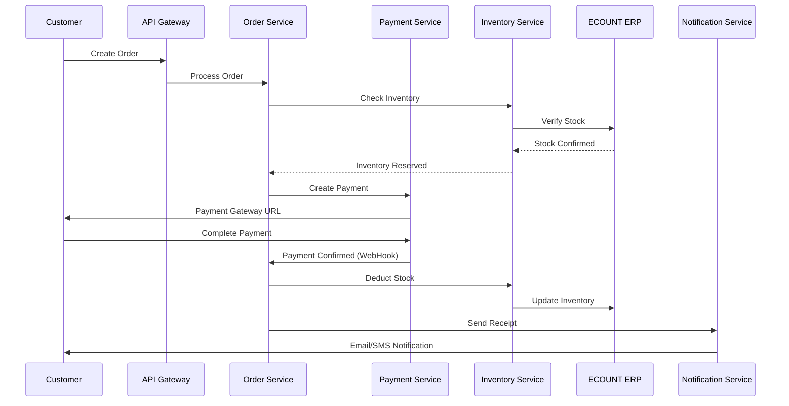
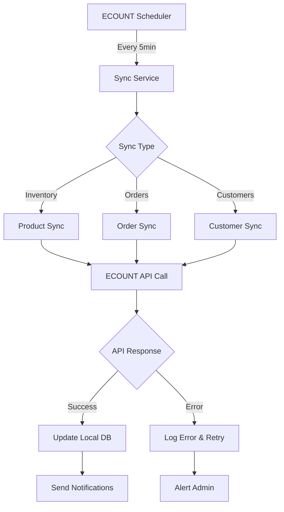
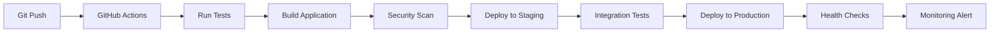

# 필리핀 전자상거래 플랫폼 아키텍처

## 시스템 개요

이 프로젝트는 필리핀 현지 결제 시스템과 ECOUNT ERP를 완벽히 연동하는 Laravel-style Node.js 기반 전자상거래 플랫폼입니다.

### 핵심 비즈니스 목표

1. **완전 자동화**: 주문 → 결제확인 → 재고차감 → 영수증발행
2. **필리핀 현지화**: PHP 통화, Manila 타임존, DPA/BIR 컴플라이언스
3. **확장 가능**: 1차 PSP 경유 → 2차 직접 연동 전환 구조

## 기술 아키텍처

### 애플리케이션 계층

```
┌─────────────────────────────────────────────────────────────┐
│                    Frontend Layer                           │
├─────────────────────┬───────────────────────────────────────┤
│   Customer Portal   │          Admin Dashboard              │
│   Vue.js 3         │          Vue.js 3                     │
│   Tailwind CSS     │          Chart.js, Tables            │
└─────────────────────┴───────────────────────────────────────┘

┌─────────────────────────────────────────────────────────────┐
│                    API Gateway Layer                        │
├─────────────────────┬───────────────────────────────────────┤
│   REST API v1      │          WebHook Endpoints            │
│   Express Router   │          PayMongo/Xendit/Dragonpay    │
│   JWT Auth         │          ECOUNT Callbacks             │
└─────────────────────┴───────────────────────────────────────┘

┌─────────────────────────────────────────────────────────────┐
│                   Business Logic Layer                      │
├─────────────────────┬───────────────────────────────────────┤
│   Controllers      │          Services                     │
│   - OrderController│          - PaymentService             │
│   - ProductController│        - EcountSyncService          │
│   - CustomerController│       - ComplianceService          │
│   - PaymentController│        - NotificationService        │
└─────────────────────┴───────────────────────────────────────┘

┌─────────────────────────────────────────────────────────────┐
│                    Data Access Layer                        │
├─────────────────────┬───────────────────────────────────────┤
│   ORM Models       │          Repositories                 │
│   Prisma Schema    │          - OrderRepository            │
│   Database Migrations│        - ProductRepository          │
│   Seeders          │          - CustomerRepository        │
└─────────────────────┴───────────────────────────────────────┘

┌─────────────────────────────────────────────────────────────┐
│                   Infrastructure Layer                      │
├─────────────────────┬───────────────────────────────────────┤
│   Database         │          External Services            │
│   PostgreSQL       │          - ECOUNT ERP API             │
│   Redis (Cache)    │          - PayMongo API               │
│   File Storage     │          - Xendit API                 │
│                    │          - Dragonpay API              │
└─────────────────────┴───────────────────────────────────────┘
```

### 마이크로서비스 분할 (향후)

```
┌─────────────────┐  ┌─────────────────┐  ┌─────────────────┐
│   Order Service │  │ Payment Service │  │ Inventory Svc   │
│                 │  │                 │  │                 │
│ - Order CRUD    │  │ - Gateway Mgmt  │  │ - Stock Sync    │
│ - Status Mgmt   │  │ - Webhook Proc  │  │ - ECOUNT API    │
│ - BIR Receipt   │  │ - Refund Proc   │  │ - Alerts        │
└─────────────────┘  └─────────────────┘  └─────────────────┘

┌─────────────────┐  ┌─────────────────┐  ┌─────────────────┐
│Customer Service │  │ Notification    │  │ Compliance      │
│                 │  │ Service         │  │ Service         │
│ - Profile Mgmt  │  │ - Email/SMS     │  │ - DPA Audit     │
│ - DPA Rights    │  │ - Push Notify   │  │ - BIR Reports   │
│ - Auth/Session  │  │ - Templates     │  │ - Data Export   │
└─────────────────┘  └─────────────────┘  └─────────────────┘
```

## 데이터 흐름 아키텍처

### 주문 처리 플로우



### ECOUNT 동기화 플로우



## 보안 아키텍처

### 인증 및 권한 관리

```
┌─────────────────────────────────────────────────────────────┐
│                    Security Layers                          │
├─────────────────────┬───────────────────────────────────────┤
│   Frontend Auth    │          API Security                 │
│   - JWT Tokens     │          - Rate Limiting              │
│   - Refresh Tokens │          - CORS Policy                │
│   - Session Mgmt   │          - Helmet.js                  │
└─────────────────────┴───────────────────────────────────────┘

┌─────────────────────────────────────────────────────────────┐
│                   Data Protection (DPA)                     │
├─────────────────────┬───────────────────────────────────────┤
│   Encryption       │          Access Control               │
│   - AES-256 at rest│          - RBAC System               │
│   - TLS in transit │          - Audit Logging              │
│   - PII Masking    │          - Consent Management         │
└─────────────────────┴───────────────────────────────────────┘
```

### 결제 보안

1. **PCI DSS 준수**: 카드 정보는 PSP에서만 처리
2. **웹훅 검증**: 각 게이트웨이별 signature 검증
3. **중복 거래 방지**: Idempotency keys 사용
4. **금액 검증**: 서버사이드 double-check

## 컴플라이언스 아키텍처

### DPA (Data Privacy Act) 준수

```
┌─────────────────────────────────────────────────────────────┐
│                 Data Subject Rights Engine                   │
├─────────────────────┬───────────────────────────────────────┤
│   Article 15        │          Article 17                   │
│   Right of Access   │          Right to Erasure            │
│   - Data Export     │          - Automated Deletion         │
│   - 72hr Response   │          - 30-day Processing          │
└─────────────────────┴───────────────────────────────────────┘

┌─────────────────────────────────────────────────────────────┐
│                    Consent Management                        │
├─────────────────────┬───────────────────────────────────────┤
│   Consent Tracking │          Data Retention               │
│   - Granular Consent│          - Automated Purging          │
│   - Withdrawal Mgmt │          - Legal Hold Override        │
│   - Audit Trail    │          - Business Rule Engine       │
└─────────────────────┴───────────────────────────────────────┘
```

### BIR (Bureau of Internal Revenue) 준수

```
┌─────────────────────────────────────────────────────────────┐
│                Electronic Receipt Engine                     │
├─────────────────────┬───────────────────────────────────────┤
│   Receipt Generation│          Tax Calculation              │
│   - BIR Format PDF  │          - VAT Computation            │
│   - Digital Signature│         - Zero-rated Items           │
│   - Sequence Control │         - Exempt Transactions        │
└─────────────────────┴───────────────────────────────────────┘

┌─────────────────────────────────────────────────────────────┐
│                    Reporting System                         │
├─────────────────────┬───────────────────────────────────────┤
│   Monthly Reports   │          Audit Trail                  │
│   - Sales Summary   │          - All Transactions           │
│   - VAT Summary     │          - Receipt Sequences          │
│   - Export Ready    │          - Void Tracking              │
└─────────────────────┴───────────────────────────────────────┘
```

## 성능 및 확장성

### 캐싱 전략

```
┌─────────────────────────────────────────────────────────────┐
│                     Cache Layers                            │
├─────────────────────┬───────────────────────────────────────┤
│   Redis Cache      │          Application Cache            │
│   - Session Store   │          - Product Catalog            │
│   - Rate Limiting   │          - Category Trees             │
│   - Queue Jobs     │          - Exchange Rates             │
└─────────────────────┴───────────────────────────────────────┘
```

### 데이터베이스 최적화

```
┌─────────────────────────────────────────────────────────────┐
│                  Database Strategy                          │
├─────────────────────┬───────────────────────────────────────┤
│   Read Replicas    │          Partitioning                 │
│   - Product Queries │          - Orders by Date            │
│   - Analytics      │          - Audit Logs by Month        │
│   - Reports        │          - Customer Data by Region    │
└─────────────────────┴───────────────────────────────────────┘
```

### 큐 시스템

```
┌─────────────────────────────────────────────────────────────┐
│                    Job Queue System                         │
├─────────────────────┬───────────────────────────────────────┤
│   High Priority    │          Low Priority                 │
│   - Payment Process │          - Email Notifications        │
│   - Stock Updates   │          - Analytics Updates          │
│   - Order Status    │          - Report Generation          │
└─────────────────────┴───────────────────────────────────────┘
```

## 모니터링 및 로깅

### 로그 구조

```
┌─────────────────────────────────────────────────────────────┐
│                    Logging Architecture                     │
├─────────────────────┬───────────────────────────────────────┤
│   Application Logs │          Audit Logs                   │
│   - Error Tracking  │          - User Actions               │
│   - Performance    │          - Data Changes               │
│   - Debug Info     │          - Access Logs                │
└─────────────────────┴───────────────────────────────────────┘

┌─────────────────────────────────────────────────────────────┐
│                    Metrics Collection                       │
├─────────────────────┬───────────────────────────────────────┤
│   Business Metrics │          Technical Metrics            │
│   - Order Volume    │          - Response Times             │
│   - Revenue Trends  │          - Error Rates               │
│   - Customer Activity│         - Resource Usage             │
└─────────────────────┴───────────────────────────────────────┘
```

## 배포 아키텍처

### 환경 구성

```
┌─────────────────────────────────────────────────────────────┐
│                 Development Environment                      │
├─────────────────────┬───────────────────────────────────────┤
│   Local Dev        │          Testing                      │
│   - SQLite DB      │          - Jest Unit Tests            │
│   - Mock APIs      │          - Integration Tests          │
│   - Hot Reload     │          - E2E Testing               │
└─────────────────────┴───────────────────────────────────────┘

┌─────────────────────────────────────────────────────────────┐
│                 Production Environment                       │
├─────────────────────┬───────────────────────────────────────┤
│   Load Balancing   │          High Availability            │
│   - Nginx Proxy    │          - DB Failover               │
│   - PM2 Clustering │          - Redis Cluster             │
│   - Health Checks  │          - Backup Systems            │
└─────────────────────┴───────────────────────────────────────┘
```

### CI/CD 파이프라인



## API 설계 원칙

### RESTful API 구조

```
GET    /api/v1/products              # 상품 목록
GET    /api/v1/products/:id          # 상품 상세
POST   /api/v1/orders                # 주문 생성
GET    /api/v1/orders/:id            # 주문 조회
PATCH  /api/v1/orders/:id/status     # 주문 상태 변경

POST   /api/v1/payments/create       # 결제 생성
GET    /api/v1/payments/:id          # 결제 상태 조회

POST   /webhooks/paymongo            # PayMongo 웹훅
POST   /webhooks/xendit              # Xendit 웹훅
POST   /webhooks/dragonpay           # Dragonpay 웹훅

GET    /api/v1/ecount/status         # ECOUNT 연결 상태
POST   /api/v1/ecount/sync           # 수동 동기화
```

### 응답 형식 표준

```json
{
  "success": true|false,
  "message": "Operation completed successfully",
  "data": {
    // 실제 데이터
  },
  "meta": {
    "pagination": {...},
    "filters": {...}
  },
  "timestamp": "2025-08-26T11:24:20.499Z",
  "timezone": "Asia/Manila",
  "currency": "PHP"
}
```

## 에러 처리 전략

### 에러 분류

1. **Validation Errors (400)**: 입력값 검증 실패
2. **Authentication Errors (401)**: 인증 실패
3. **Authorization Errors (403)**: 권한 부족
4. **Not Found Errors (404)**: 리소스 없음
5. **Payment Errors (402)**: 결제 실패
6. **Integration Errors (503)**: 외부 시스템 연동 실패
7. **DPA Violations (403)**: 개인정보보호 위반

### 복구 메커니즘

1. **자동 재시도**: 네트워크 오류, API 호출 실패
2. **수동 재처리**: 결제 실패, 동기화 오류
3. **알림 시스템**: 관리자 대시보드, 이메일 알림
4. **로그 추적**: 상세 에러 로그 및 컨텍스트

이 아키텍처는 필리핀 전자상거래 시장의 특수성을 고려하여 설계되었으며, 확장 가능하고 유지보수가 용이한 구조를 제공합니다.

---

**Last Updated**: 2025-08-26  
**Version**: 1.0.0  
**Timezone**: Asia/Manila